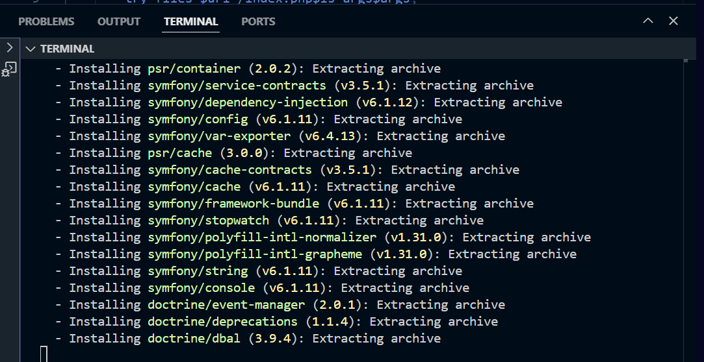

# Projet Symfony avec Docker

Ce projet est une application Symfony utilisant Docker pour le développement.

## Prérequis
- Docker
- Docker Compose
- Git

## Installation

1. **Cloner le projet**
```bash
git clone [URL_DU_PROJET]
cd unit_symfony
```

2. **Lancer les conteneurs Docker**
```bash
docker-compose up -d --build
```

## Structure des conteneurs

- **PHP-FPM (app)**: Application Symfony
- **Nginx (webserver)**: Serveur web sur le port 8080
- **MySQL (database)**: Base de données
- **Adminer**: Interface de gestion de BDD sur le port 8081
- **phpMyAdmin**: Interface alternative de BDD sur le port 8082

## Accès aux interfaces

- Application Symfony: http://localhost:8080
- Adminer: http://localhost:8081
  - Système: MySQL
  - Serveur: symfony_db
  - Utilisateur: symfony
  - Mot de passe: symfony
  - Base de données: symfony

- phpMyAdmin: http://localhost:8082
  - Serveur: symfony_db
  - Utilisateur: symfony
  - Mot de passe: symfony

## Gestion des utilisateurs

### Utilisateurs par défaut

1. **Admin**
   - Email: admin@example.com
   - Mot de passe: admin123
   - Rôle: ROLE_ADMIN

2. **Utilisateur standard**
   - Email: user@example.com
   - Mot de passe: 12345
   - Rôle: ROLE_USER

### Commandes utiles

1. **Créer un nouvel utilisateur**
```bash
docker-compose exec app php bin/console app:create-user --email="email@example.com" --password="password" --name="Name" --role="ROLE_USER"
```

2. **Supprimer un utilisateur**
```bash
docker-compose exec app php bin/console app:delete-user email@example.com
```

## Captures d'écran


*Interface de connexion*


*Interface d'administration*


*Gestion des utilisateurs*

## Commandes Docker utiles

1. **Démarrer les conteneurs**
```bash
docker-compose up -d
```

2. **Arrêter les conteneurs**
```bash
docker-compose down
```

3. **Voir les logs**
```bash
docker-compose logs -f
```

4. **Accéder au conteneur PHP**
```bash
docker-compose exec app bash
```

## Commandes Symfony utiles

1. **Vider le cache**
```bash
docker-compose exec app php bin/console cache:clear
```

2. **Créer une migration**
```bash
docker-compose exec app php bin/console make:migration
```

3. **Appliquer les migrations**
```bash
docker-compose exec app php bin/console doctrine:migrations:migrate
```
